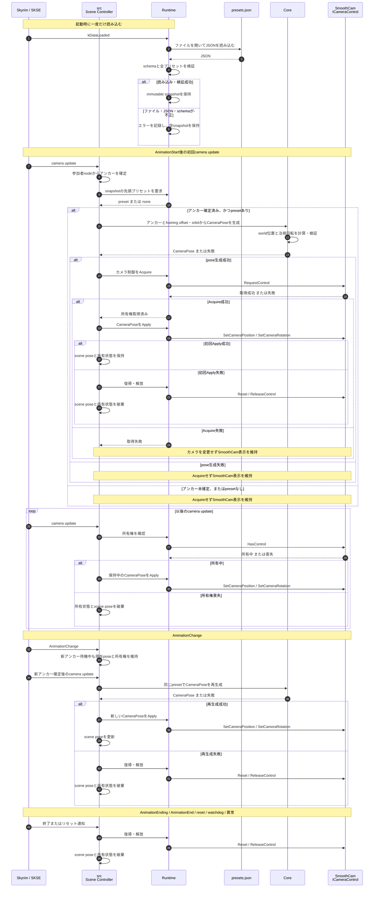

# 固定プリセット読み込みとカメラ制御の設計

状態: **実装済み／schema version 3へ移行済み**

## 目的

特定のファイルから固定カメラ構図を読み込み、プレイヤー参加シーンのアンカー確定後にSmoothCamからカメラ制御を取得して、画面相対のframing offsetを保ったままアンカーをorbitする位置から映す。

この設計の対象は、ファイル入力からゲーム内カメラ出力までの最小経路である。CRUDと複数プリセットのUI操作は後続設計で実装済みだが、raycast、clearance、補間は含めない。

## 最小成立条件

次のすべてを満たした場合だけカメラ制御を取得する。

1. 固定ファイルを読み込める。
2. 1件以上の有効なプリセットを取得できる。
3. 現在のシーンアンカーが確定している。
4. プリセットのframing offsetとorbitをworld poseへ変換できる。
5. world位置からframing centerを見る有限な回転を生成できる。
6. SmoothCamがカメラ制御を渡せる。

いずれかが失敗した場合はカメラを取得せず、通常のSmoothCam表示を維持する。

## 固定ファイル

初期ファイルは次の1個に固定する。

```text
Data/SKSE/Plugins/SexlabSceneCamera/presets.json
```

配布物にも同じ相対パスで配置する。UIから同じファイルを明示的にreloadできるが、複数ファイルの探索や別ファイルによる階層的な上書きは行わない。

構造化されたプリセット配列と将来のCRUDを扱いやすくするためJSONを使用する。既存の依存関係に`nlohmann-json`が含まれているため、新しいparser依存は追加しない。

## schema version 3

SKSE Menuに表示する設定と操作の仕様は[`preset-settings-spec.md`](preset-settings-spec.md)に分離する。以下は固定プリセット読込で使用する保存形式である。

```json
{
  "schemaVersion": 3,
  "presets": [
    {
      "id": "default",
      "framingOffset": {
        "right": 0.0,
        "up": 0.0
      },
      "orbit": {
        "yawDegrees": 0.0,
        "pitchDegrees": 16.699244,
        "distance": 208.80613
      }
    }
  ]
}
```

- `schemaVersion`は必須とし、`1`、`2`、`3`を読み込める。書き込みは常に`3`とする。
- `presets`は配列とする。最初の縦切りでは先頭の有効な1件だけを使用するが、loaderは全件を読み込む。
- `id`は空でないUTF-8文字列とし、ファイル内で一意にする。後続CRUDでも同じIDを使用する。
- `framingOffset.right`は現在のcamera right方向、`framingOffset.up`は現在のcamera up方向にframing centerを移動する量である。有限な数値とし、単位はSkyrim unitとする。
- `orbit.yawDegrees`は注視中心を回る水平角で、`-180`から`180`度とする。`0`度ではアンカー後方にカメラを置く。
- `orbit.pitchDegrees`は仰俯角で、`-90`から`90`度とする。正値ではカメラを注視中心より上へ置く。
- `orbit.distance`は注視中心からカメラまでの距離で、有限かつ0より大きいSkyrim unitとする。
- FOVとrollは保存しない。カメラは常にframing centerを見る。
- schema version 1の`offset`は、framing offsetを0にした等価なyaw、pitch、distanceへ読み込み時に変換する。
- schema version 2の`pivotOffset`はcamera right、camera up、view forwardへ分解する。rightとupはframing offsetへ、forwardはdistanceへ畳み込み、表現可能な構図では旧カメラ位置と視線を維持する。
- version 2でアンカーがカメラ後方になる特殊な構図は、符号付きdistanceなしでは同じ視線を表現できない。この場合はカメラ位置を維持し、注視先をアンカーへ戻す。
- 旧versionは次のCRUD保存でversion 3になる。
- 未知のトップレベルまたはプリセット項目は、同じschema version内の後方互換な拡張として無視する。
- 必須項目の欠落、型違い、非有限値、重複IDはファイル全体の読み込み失敗とする。部分的な採用は初版では行わない。

## 座標変換

アンカーの水平forwardを`F`、world上方向を`U = (0, 0, 1)`、右方向を`R = F × U`とする。yawを`y`、pitchを`p`とすると、画面座標系は次になる。

```text
viewForward = R * (-sin(y) * cos(p))
            + F * ( cos(y) * cos(p))
            + U * (-sin(p))

cameraRight = R * cos(y) + F * sin(y)
cameraUp = cameraRight × viewForward

framingCenter = anchor.position
              + cameraRight * framingOffset.right
              + cameraUp * framingOffset.up

cameraPosition = framingCenter - viewForward * distance
```

現在のアンカー実装ではforwardが水平かつ正規化済みなので、`R`も水平な単位ベクトルになる。たとえば`F = (0, 1, 0)`なら`R = (1, 0, 0)`である。framing offsetは画面平面に固定されるため、yawやpitchを変更してもアンカーの画面内オフセットは変わらない。

view forward方向への平行移動は、カメラ位置と向きを計算するとdistance変更と同じ結果になる。そのためversion 3ではforward offsetを持たない。

カメラの視線方向は次で求める。

```text
viewForward = normalize(framingCenter - cameraPosition)
```

この方向とworld上方向から、既存の`CameraPose.rotation`へ渡す直交回転行列をCoreで生成する。distanceが0以下、正規化できない、行列に非有限値が生じる場合はpose生成失敗とする。真上・真下から見る配置ではworld上方向との外積が退化するため、アンカーrightを補助軸として使用する。

## 読み込み時期と保持

- `kDataLoaded`で初回読込を行い、検証済みプリセットのimmutable snapshotを保持する。以後はUIから明示的にreloadできる。
- camera update hook内ではファイルI/OやJSON parseを行わない。
- 初回読込でファイルが存在しない、開けない、parseできない、schema検証に失敗した場合はエラーをログへ記録し、snapshotを空にする。reload失敗時は最後に有効だったsnapshotを維持する。
- プリセット読み込み失敗だけではDLLのロードを失敗させない。
- 外部変更は自動監視せず、明示的なreload時だけ反映する。

## 責務分割

### Runtime

- 固定パスからファイルを読み込む。
- JSONをRuntimeの値型へ変換し、schemaと基本的な入力値を検証する。
- 読み込み結果のsnapshotを`src`へ提供する。
- 既存のSmoothCam APIを使ってカメラ制御を取得、pose反映、復帰、解放する。
- ファイルI/O、JSON、SmoothCam、ゲーム型をCoreへ公開しない。

### Core

- アンカー、画面相対framing offset、orbitからworld位置を計算する。
- world位置からframing centerを見る回転行列を計算する。
- 非有限値と退化した入力を拒否する。
- ファイル、SmoothCam、ゲーム状態を知らない。

### src

- アンカー確定後に先頭のプリセットを取得する。
- Coreへpose計算を要求する。
- pose生成成功後だけRuntimeへカメラ取得と反映を要求する。
- シーンとカメラ所有権のライフサイクルを管理する。

## 実行手順



SmoothCamの取得・反映・復帰・解放は新しく作り直さず、POCで実機確認済みの`ICameraControl`経路を使用する。

## 失敗時の扱い

| 失敗 | 動作 |
| --- | --- |
| ファイルなし・読み取り失敗 | エラーログを出し、プリセット0件として継続する |
| JSONまたはschema不正 | 理由をログへ出し、ファイル全体を不採用にする |
| プリセット0件 | 対象シーンでもカメラを取得しない |
| pose計算失敗 | カメラを取得せず、そのシーンの処理を終了する |
| SmoothCam取得失敗 | カメラを変更せず、そのシーンの処理を終了する |
| 初回Apply失敗 | 取得済みなら直ちに復帰・解放する |
| 所有権喪失 | 以後Applyせず、内部所有状態とscene poseを破棄する |
| AnimationChange後のpose再計算失敗 | 現在poseを維持せず、復帰・解放する |

## 初版で扱わないもの

- `A` / `D`によるプリセット切り替え。
- プリセットの作成、更新、削除、reload。
- 個別ファイル、フォルダ探索、優先順位、上書き。
- FOVとrollのファイル指定。
- camera poseの補間。
- LOS、raycast、clearance、有効候補の選択。
- 保存データまたはSKSE co-saveへの永続化。

## テスト

### Core test

- `forward = +Y`のアンカーでframing offsetとorbitが期待するworld位置になる。
- アンカーforwardが回転した場合も同じローカル構図になる。
- 生成した回転の視線方向がframing centerを向く。
- framing right/upがyaw・pitch変更後も同じ画面内成分になる。
- framing offset 0ではyaw、pitch、distanceとworld位置の相互変換が一致する。
- 真上・真下のカメラ位置でも有限な回転を生成する。
- distance 0、非有限値、退化入力を拒否する。

### Loader test

- 正常なschemaを全件読み込める。
- ファイルなし、壊れたJSON、未知version、必須項目欠落、型違い、非有限値、重複IDを拒否する。
- 未知の追加項目を無視できる。

### ゲーム内確認

1. 固定ファイルを配置してプレイヤー参加シーンを開始する。
2. アンカー確定後にカメラが指定orbit位置へ移動し、framing centerを向くことを確認する。
3. アニメーション変更後、新しいアンカーを基準に位置と向きが更新されることを確認する。
4. シーン終了後にSmoothCamへ戻ることを確認する。
5. ファイル削除、不正JSON、極端な値で、カメラを取得せずゲームが継続することを確認する。

ビルド成功はファイルパス、カメラ行列、SmoothCamとの実行順を保証しないため、上記は実機確認を完了条件とする。
